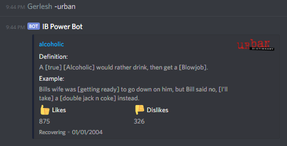

# IB Power Bot
## Description
A cool bot with various functions for students on Discord.

## Usage
All example commands are using ```-``` as the bot prefix.
### Help Command
- ```-help``` will give you broad details on all commands\

- ```-help <command>``` will give you more detailed information on a specific command\


### Homework Command
- ```-homework <teacher> set <homework>``` will set homework for a teacher.\

- ```-homework``` will show all the teachers with recorded homework.\

- ```-homework <teacher>``` will show homework for a specific teacher.\

- ```-homework <teacher> add <homework>``` will add homework to a teacher.\

- ```-homework <teacher> clear``` will clear all homework from a teacher.\


### Reminder Command
- ```-reminder <time> <message>``` will ping you with a reminder when the time is up. **IMPORTANT: IF THE BOT TURNS OFF FOR ANY PERIOD OF TIME THE REMINDER WILL NOT BE CARRIED OUT.**\


### Resources Command
- ```-resources``` will show resources with their links (Requires ```resources.json``` to have been filled out)\


### Role Command
- ```-role <role>``` will add/remove roles from the command user (case sensitive). **IMPORTANT: THIS COMMAND WILL ADD/REMOVE ANY DEFAULT COLOURED ROLE BELOW THE BOT'S HIGHEST ROLE. MAKE SURE ANY ROLES THAT FIT THESE CRITERIA ARE CHANGED IF YOU DON'T WANT EVERYONE TO HAVE ACCESS TO IT**\


### Urban Command
- ```-urban <search term>``` will return an Urban Dictionary result for the search term specified.

- ```-urban``` will return a random Urban Dictionary result.


## Installation
1. Download and install [Node.js](https://nodejs.org/en/).
2. Go to [Discord\'s developer portal](https://discordapp.com/developers) to obtain a Discord bot token for the bot.
3. Run ```installer.bat``` to install bot dependencies.
4. Run ```run.bat``` to run the bot.

If you accidentally close the installer window before it is finished, delete any files (```node_modules``` folder, ```config.json```, ```resources.json```, and ```run.bat```) it has made and restart it.
### Editing Config and Resource files
If your config and resource files don't exist yet, run ```installer.bat``` first.

#### Config
- The config file (```config.json```) should contain the following code:
```json
{
   "prefix":"YOUR_PREFIX_HERE",
   "token":"YOUR_TOKEN_HERE",
   "mod":[
   ]
}
```
- ```YOUR_PREFIX_HERE``` should contain the prefix you chose in the Installer (if not, change it in the file).
- ```YOUR_TOKEN_HERE``` should contain the token you submitted in the installer (if not,  change it in the file).
- To add server moderators, use the following format:
```json
"mod":[
   "MOD_ID_HERE",
   "MOD_ID_HERE",
   ...
   "MOD_ID_HERE"
]
```
- Replace ```MOD_ID_HERE``` with the moderators' Discord IDs.
- Make sure there are commas after each ID (except the last one).

#### Resources
- The resources file (```resources.json```) should contain the following code:
```json
{
}
```
- The file is empty on installation. This means that if you use the ```-resources``` command, the embed will be empty.
- To add resources, use the following format:
```json
{
   "RESOURCE_NAME":"RESOURCE_LINK",
   "RESOURCE_NAME":"RESOURCE_LINK",
   ...
   "RESOURCE_NAME":"RESOURCE_LINK"
}
```
- Replace ```RESOURCE_NAME``` with your resource's name.
- Replace ```RESOURCE_LINK``` with a link to your resource.
- Again, the commas must be after each resource (except the last one).
